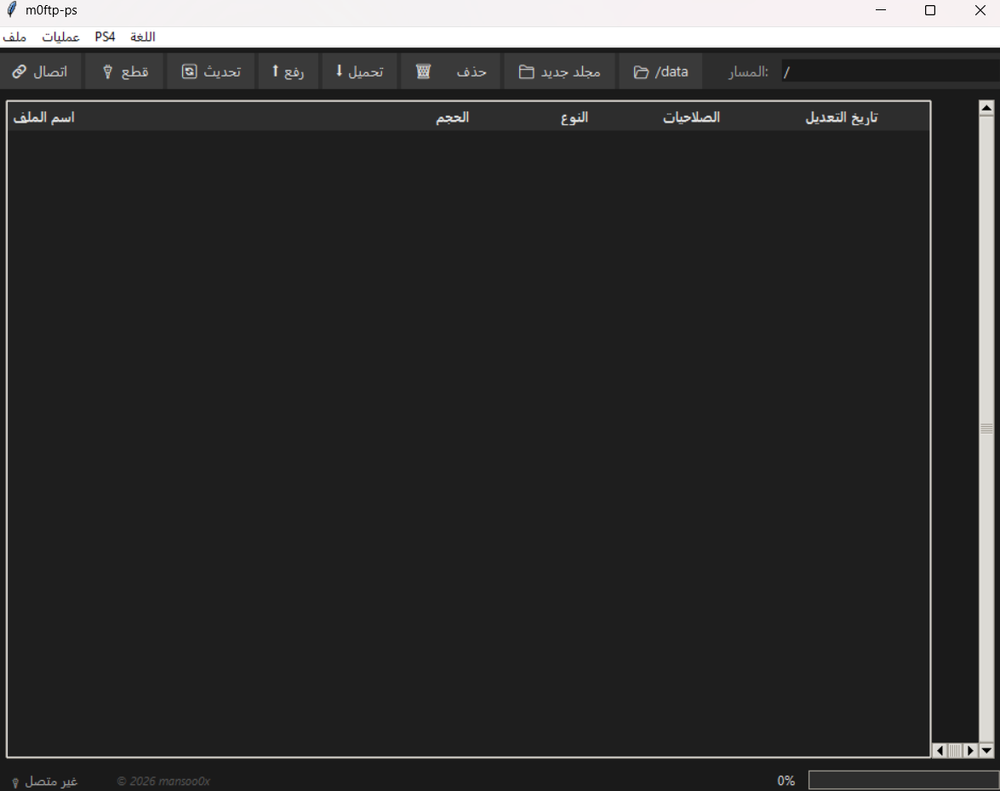
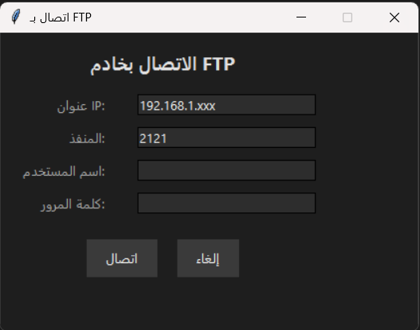
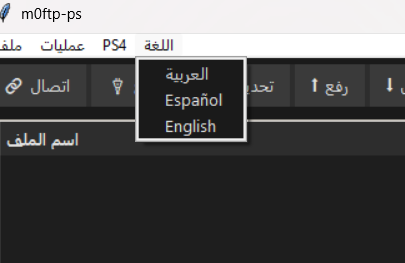

# m0ftp-ps - FTP Manager for PS4


> أداة FTP احترافية مفتوحة المصدر لإدارة ملفات PS4 بواجهة أنيقة (داركر مود) مع دعم ثلاث لغات: العربية، الإسبانية، الإنجليزية.


---

## ✨ المميزات

- **اتصال سهل بخادم FTP** (يدعم PS4 وغيره).

- **ترجمة فورية** بين العربية، الإسبانية، والإنجليزية.
- **عمليات الملفات الأساسية**: رفع، تحميل، حذف، إعادة تسمية، إنشاء مجلد.
- **شريط تقدم** يعرض نسبة الإنجاز أثناء الرفع/التحميل.
- **انتقال سريع** إلى المسار `/data` الخاص بـ PS4.
- **قائمة سياق** بالنقر بزر الماوس الأيمن.

---

## 🖥️ لقطات الشاشة

| النافذة الرئيسية | نافذة الاتصال |
|------------------|---------------|
|  |  |

| رفع ملف | تحميل ملف |
|---------|-----------|
|  |  |

---

## 🚀 كيفية التثبيت والتشغيل

### المتطلبات
- Python 3.6 أو أحدث.
- لا حاجة لمكتبات إضافية (كل شيء مدمج في Python).

### الخطوات
1. **استنساخ المستودع**:
   ```bash
   git clone https://github.com/your-username/m0ftp-ps.git
   cd m0ftp-ps
